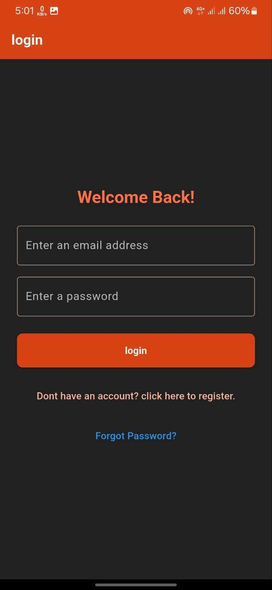
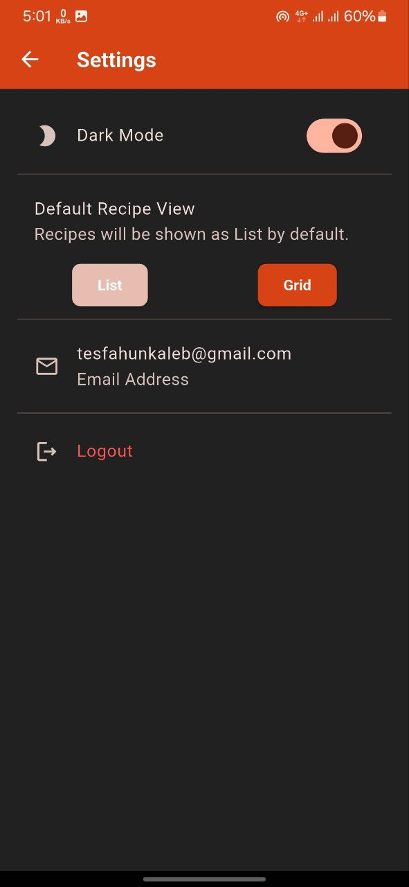

# 🍽️ Meal Organizer

An offline-first recipe and meal planning app built with **Flutter**, featuring secure authentication and local data persistence.  
Meal Organizer helps you save recipes, plan meals, and keep everything organized in one place.

---

## ✨ Features

- 🔐 **Firebase Authentication** – Sign up, log in, and manage accounts securely.  
- 📦 **SQLite Local Storage** – Recipes stored locally for offline access.  
- ➕ **CRUD Operations** – Create, update, delete, and view recipes with ingredients and steps.  
- ⚡ **Streams for Live Updates** – UI updates instantly when data changes.  
- 🔎 **Search Recipes** – Quickly find saved recipes.  
- ❤️ **Favorites** – Mark recipes you love for faster access.  
- 📅 **Meal Planner** – Use a table calendar to plan meals throughout the week/month.  

---

## 🚧 Roadmap

Planned features:  
- 🛒 Shopping list generator  
- ⏱️ Cooking timers  
- 📲 Recipe sharing via QR code  

---

## 🛠️ Tech Stack

- **Framework:** Flutter  
- **Database:** SQLite  
- **Authentication:** Firebase Auth  
- **State Updates:** Streams  

---

## 📸 Screenshots

>
 


---

## 🚀 Getting Started

### Prerequisites
- [Flutter SDK](https://docs.flutter.dev/get-started/install)  
- Firebase project set up with Authentication enabled  
- Android/iOS emulator or physical device  

### Installation
```bash
# Clone the repository
git clone https://github.com/kalutm/MyRecipeBox.git
cd MyRecipeBox

# Install dependencies
flutter pub get

# Run on emulator/device
flutter run

🤝 Contributing
Contributions are welcome. Please fork the repo and submit a pull request.